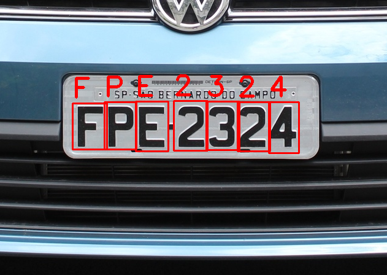

# OCR-Leitura-de-Placa-Veicular

|  |
| :---------------------------------: |
| Fonte: https://www.icarros.com.br/noticias/manutencao-e-servicos/sp:-licenciamento-para-placas-final-4-ja-comecou/21045.html |

## Motivação

No desenvolvimento de aplicações de visão computacional uma etapa que comumente consome tempo e recursos financeiros é a etapa de construção de *datasets*, que normalmente requer:

- A aquisição de imagens;
- A anotação de cada classe de imagem para problemas de classificação;
- A anotação da posição dos objetos nas imagens (Seja em problemas de detecção de objetos ou de segmentação).

Existem algumas ferramentas que podem acelerar essas etapas, algumas open source (Ex.: [LOST](https://lost.readthedocs.io/en/latest/#)) e algumas pagas, onde é possível terceirizar a anotação do dataset (Ex.: [Amazon Mechanical Turk](https://www.mturk.com/)). Estas ferramentas estão fora do escopo do artigo.

Uma abordagem que merece atenção especial, quando possível, é a geração de dados sintéticos, que representem com a maior fidelidade possível o problema real que se busca resolver. Assim, é possível também acelerar o processo de anotação de dados, uma vez que na maioria das vezes durante o processo de geração das imagens já é possível separá-las em classes, ou indicar a posição dos objetos nas mesmas.

Este artigo busca demonstrar como podemos treinar um modelo para o problema de leitura dos caracteres da placa de um veículo, sem a necessidade de termos um dataset com imagens reais.

> Uma guia completo sobre este repositório pode ser encontrado neste [artigo medium](https://medium.com/data-hackers/treinando-um-modelo-de-ocr-com-dados-sint%C3%A9ticos-7e8becf869e).